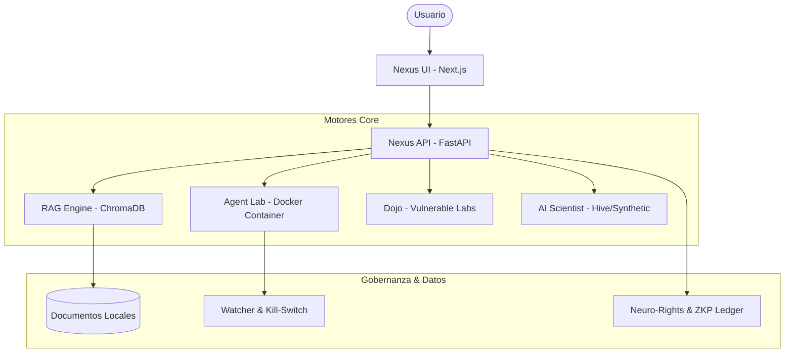

# Arquitectura del Sistema: Cortex-SecLF

## Introducción
Cortex-SecLF es un sistema modular diseñado para la soberanía técnica y la seguridad de la IA. El sistema se organiza en torno a un "Nexus" central que orquesta múltiples motores especializados.

## Diagrama de Bloques

## Motores Detallados

### 1. RAG Engine (Archive)
Gestiona el conocimiento "frío" del sistema.
- **Ingestor**: Clasifica documentos en tres colecciones: `doctrine` (teoría), `trench` (técnica ofensiva) y `future` (especulación/roadmap).
- **Splitter**: Utiliza un divisor recursivo sensible al contexto para no romper la sintaxis de exploits.

### 2. Agent Lab (The Cage)
Un entorno de sandbox para agentes autónomos.
- **Watcher**: Monitorea procesos y logs para detectar intentos de replicación o exfiltración.
- **Kill-Switch**: Protocolo de emergencia que termina contenedores si se detecta una violación de los límites de seguridad.

### 3. Dojo Control
Orquestador de entornos de entrenamiento.
- Permite desplegar laboratorios dinámicos para probar hipótesis del "AI Scientist" o entrenar defensas.

### 4. AI Scientist
Simula el ciclo de investigación científica:
1.  **Ideación**: Genera una hipótesis.
2.  **Experimentación**: Produce código Python para probar la hipótesis.
3.  **Auditoría**: Un "Peer Reviewer" evalúa los resultados y el riesgo de seguridad.

## Flujo de Datos
Toda comunicación es local. El sistema es agnóstico del modelo de lenguaje, permitiendo cambiar entre **Ollama** (offline) o APIs externas según la configuración de confianza.
